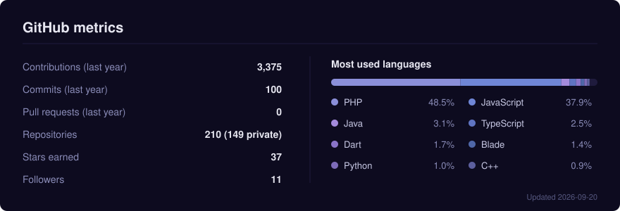

<!-- Header -->
<p align="center">
  
</p>

<p align="center">
  
</p>

<p align="center">
  <a href="mailto:hi@kodla.agency"></a>
  <a href="https://utkuhalis.com.tr"></a>
  <a href="https://www.linkedin.com/in/utkuhalis/"></a>
</p>

---

### 👨‍💻 About me

```yaml
name:        Utku Halis
role:        Founder @ Kodla Digital Agency
experience:  16+ years
journey:     VB6 → PHP → Laravel → Flutter → Odoo → C / bare metal
location:    Northern Cyprus 🇨🇾
day_job:     web, mobile, ERP
night_job:   kernels, console homebrew, audio synthesis
```

- 🏢 Running **Kodla Digital Agency**: web, mobile and ERP projects for clients
- 🐘 Started with **Visual Basic 6**, fell for **PHP** early and never really left
- ⚙️ Deep in **Laravel**, **Flutter** and **Odoo 18/19** customization
- 🚀 Automating everything with **GitHub Actions** & **Fastlane**
- 🧪 Off the clock: an **AArch64 hobby OS**, a **PS3 flight simulator**, procedural engine sound synthesis

---

### 🌟 Featured projects

| Project | What it is | |
|---|---|---|
| [**ARM Hobby OS**](https://github.com/utkuhalis/ARM-Hobby-Operating-System) | Minimal AArch64 kernel running on QEMU `virt` and Raspberry Pi 5 |  |
| [**ps3-homebrew**](https://github.com/utkuhalis/ps3-homebrew) | Flight simulator for PS3 written straight against the RSX with PSL1GHT. Own renderer, flight model, audio synth and asset pipeline, no engine |  |
| [**rs7-v8-simulator**](https://github.com/utkuhalis/rs7-v8-simulator) | Real-time procedural Audi RS7 V8 engine & exhaust sound synthesizer |  |
| [**etone-kasafix**](https://packagist.org/packages/utkuhalis/etone-kasafix) | PHP package on Packagist |  |

---

### 🧰 Tech stack

**Web & backend**
<p>
  
  
  
</p>

**Mobile & ERP**
<p>
  
  
  
</p>

**Low-level, games & where it all started**
<p>
  
  
</p>

**Infra**
<p>
  
</p>

---

### 📊 GitHub stats

<p align="center">
  
</p>

<p align="center">
  
</p>

<p align="center">
  
</p>

<p align="center">
  
</p>
